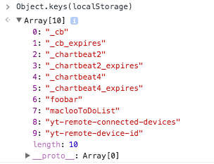

# To Do list with localStorage

This is a personal coding project. My goal is to learn about [localStorage](https://developer.mozilla.org/en-US/docs/Web/API/Web_Storage_API). It's part of my #100DaysOfCode challenge (see days 18–24 in [my log, here](https://github.com/macloo/100-days-of-code/blob/master/log.md)).

There was no tutorial, video, how-to or “challenge” for this project. I thought of it and pursued it by searching with Google, MDN and Stack Overflow.

**Step 1** was to make a form so the user can enter data into the To Do list.

**Step 2** I had to figure out how localStorage works. A pretty important thing to note is that "localStorage (at the current time) cannot hold any data type except for *strings*. You will need to serialize the array for storage and then parse it back out to make modifications to it." ([source](http://stackoverflow.com/questions/16083919/push-json-objects-to-array-in-localstorage))

So I have to `JSON.stringify()` to write the list into localStorage. But when I get it out again, I have to use `JSON.parse(localStorage.getItem('toDoList'));`

**Step 3** With localStorage working, I then needed to hide/show things using jQuery. Since this is a single-page app, I check if you have a To Do list in localStorage already. If not, you see the form to enter your first item. If you do have it already, I hide the form and show you your list. I experimented with several Bootstrap styles for the list items.

I also check whether your browser has localStorage at all. If not, I hide both the form and the list from you and post a message.

**Other steps** See dated list below. While I set out only to learn about localStorage, I also learned some new things about sorting in JavaScript — especially how to sort an array of objects based on the object's properties.

## Some things to know about localStorage

Some tutorials have you save each item with its own key. I'm not doing that. I'm saving the entire To Do list with one localStorage key. The way my code is written, I could add an option to save separate To Do lists under different key names.

If you want to see all localStorage items, run this in the JavaScript console:

```
for (var i = 0; i < localStorage.length; i++){
    console.log(localStorage.getItem(localStorage.key(i)));
}
```

If you want to delete a key and all its contents, run this in the JavaScript console (where `toDoList` is the key name):

```
localStorage.removeItem("toDoList");
```

If you want to get a list of all the keys in your localStorage:

```
Object.keys(localStorage);
```



### Aug. 26

~~I have a bug: The alert "You don't have a To Do list on this device. Use the form to create your first item" pops up twice when you have no To Do list yet, and continues to appear after you have a To Do list.~~

Fixed. This bug turned out to be a problem with hide/show, because of the hidden text and the [more]/[less] option. I was inserting the alert twice because of the way I used jQuery `.after()`.

Also today, I bundled the main operation into a function (named `main`) and rearranged the code in the JS file (`main.js`) so that functions are all at the top and event listeners are at the bottom.


### Feb. 5

This project is now complete. Of course, one could do more things with a To Do list app, but I've done everything I set out to do with this:

* The To Do items are saved only in localStorage.
* Individual To Do items can be deleted.
* Multiple To Do items can be deleted as a batch.
* The order of the items can be changed based on either their priority or their due date.
* The app runs on a single page.

### Feb. 4

Not only is the bug fixed — now the "remove" checkbox works for each To Do item! Many new lines of code added! Callooh! Callay!

### Jan. 30

~~Dang, I have a persistent bug that I swear was not there yesterday. Duplicates of To Do items, and also disappearing To Do items.~~

I think I've fixed it. Moved `var toDoItem = new Object();` down into the `getFormData()` function and that seems to have done the trick. After testing both locally and at github.io, I think it's okay.

### Jan. 29

App now reads and writes perfectly to/from localStorage. Remaining things to do:

* Add a "remove" checkbox to each item.
* Add options to reorder the list items by either priority or due date.
* Fix bug for first use when there is no localStorage key - it kills your first item and doubles the second item. Wha—?

### Jan. 28

I had some trouble with handling the array of objects correctly. At first I was writing arrays into arrays. That was because I had:

`myArray.push( JSON.parse( localStorage.getItem('myToDoList') ) );`

Where what I actually needed was:

`myArray = JSON.parse( localStorage.getItem('myToDoList') );`

That is the one place where I retrieve the data from localStorage. I write it out to localStorage every time the form is submitted, in case the user closes the browser then, but I only have to read it once — when the JS runs the first time after `$(document).ready()`
